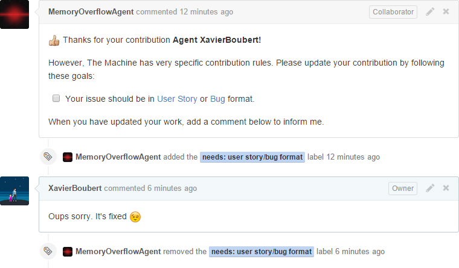

# MemoryOverflow Agent

The Machine special agent for MemoryOverflow project automated tasks.

This repository is the automated logic of the Special Agent [MemoryOverflowAgent](https://github.com/MemoryOverflowAgent). It is plugged on the main repo to help other agents to contribute without wasting time.

## Features

### Website

When the website code or content changes, MemoryOverflowAgent update the official website. He regenerate cards and pages then he push a new release on the [Website repo](https://github.com/CodeCorico/MemoryOverflow-website)

### Issue conventions

When an Agent post a new issue, MemoryOverflowAgent checks if it follows [the conventions](https://github.com/CodeCorico/MemoryOverflow/blob/master/CONTRIBUTING.md). Otherwise he posts a comment on the issue that explains how to fix the message and add the `needs: user story/bug format` label.

If an Agent fix its issue, he has to add a new comment in it so that MemoryOverflowAgent checks again the format. If the format is ok, he remove the `needs: user story/bug format` label.

### Votes

When an Agent post a new comment on an issue with a :+1: (or just `+1`) MemoryOverflowAgent counts every vote and apply `votes: +10`, `votes: +20` or `votes: +50` label on the issue. This helps to use priority filters on the main repo.

### Pull requests

In the same way as the issues, when an Agent publish a new Pull Request, MemoryOverflowAgent checks if its commits follow the [commit message format](https://github.com/CodeCorico/MemoryOverflow/blob/master/CONTRIBUTING.md#commit-message-format') and use [existing types](https://github.com/CodeCorico/MemoryOverflow/blob/master/CONTRIBUTING.md#type). Otherwise he posts a comment on the PR issue that explains how to fix the commits and add the `needs: commit guidelines` label.

If an Agent fix its PR commits, he has to add a new comment in the PR issue so that MemoryOverflowAgent checks again the format. If the format is ok, he remove the `needs: commit guidelines` label.

## Follow the project

MemoryOverflow is a card game designed by developers for developers. Go to [memoryoverflow.org](http://memoryoverflow.org) to see it in action!

* [Website](http://memoryoverflow.org)
* [Licence](https://github.com/CodeCorico/MemoryOverflow-website/blob/master/LICENSE)
* [GitHub contribution Project](https://github.com/CodeCorico/MemoryOverflow)
